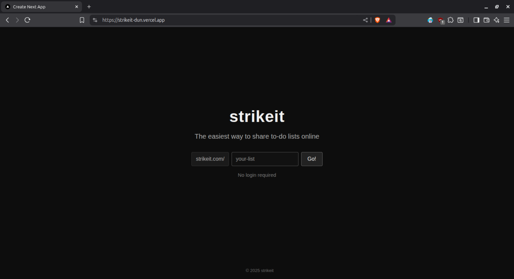

# Strikeit

A minimal, shareable to-do list app. Create lists instantly and share them via URL.

**Live Demo**: [https://rg-strikeit.vercel.app](https://rg-strikeit.vercel.app)



## Features

- Share lists via custom URLs
- Real-time sync with Redis
- Dark-mode UI
- No login required
- Rate-limited API

## Setup

1. Create a free database at [Upstash](https://console.upstash.com/)
2. Add credentials to `.env.local`:

```bash
UPSTASH_REDIS_REST_URL=your_redis_url
UPSTASH_REDIS_REST_TOKEN=your_redis_token
```

3. Install and run:

```bash
npm install
npm run dev
```

Visit [http://localhost:3000](http://localhost:3000)

## Deploy

Deploy on [Vercel](https://vercel.com/) with one click.

## License

MIT