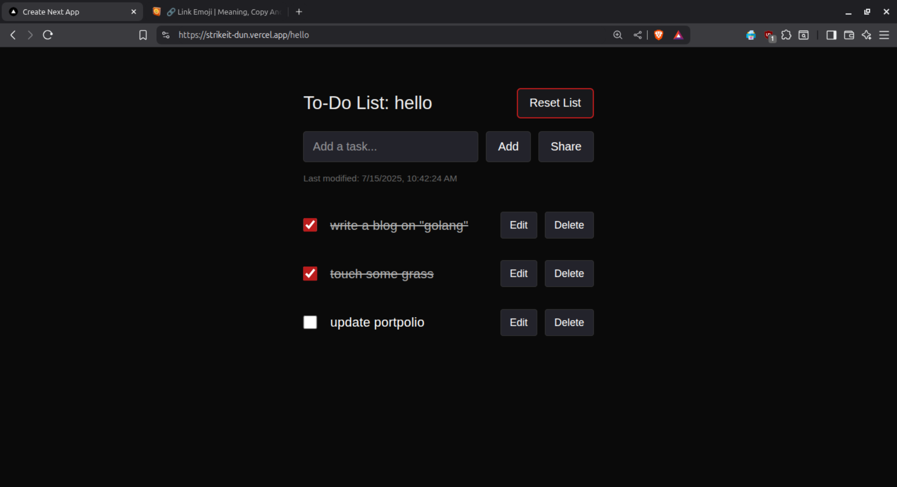

# [strikeit🔗](https://strikeit-dun.vercel.app)

The simplest way to share to-do lists online. Minimal, fast, and free.





---

## Features

- 🔗 **Shareable lists by URL** (e.g. `/my-list`)
- ⚡ **Instant sync & persistence** (Upstash Redis)
- 🕶️ **Minimal, dark-mode ready UI**
- 🚫 **No login required**
- 🛡️ **Rate-limited API**
- ☁️ **Deploys easily on Vercel**

---

## Getting Started

### 1. Set up Upstash Redis

1. [Create a free Upstash account](https://console.upstash.com/)
2. Create a new Redis database
3. Copy your Redis REST URL and token

### 2. Configure Environment Variables

Create a `.env.local` file in the root directory:

```bash
UPSTASH_REDIS_REST_URL=your_redis_url_here
UPSTASH_REDIS_REST_TOKEN=your_redis_token_here
```

### 3. Install Dependencies & Run Locally

```bash
npm install
npm run dev
```

Visit [http://localhost:3000](http://localhost:3000) and start your list!

---

## Project Structure

- [`src/app`](src/app) — Next.js app directory (routing, pages, API)
- [`src/components/ToDoList.tsx`](src/components/ToDoList.tsx) — Main to-do list UI component
- [`src/app/api/tasks/[...slug]/route.ts`](src/app/api/tasks/[...slug]/route.ts) — REST API for tasks (CRUD, Upstash Redis)
- [`db/tasks.json`](db/tasks.json) — Example local data (not used in production)
- [`public/`](public/) — Static assets

---

## Deploy

Deploy instantly on [Vercel](https://vercel.com/) (free tier works great).

